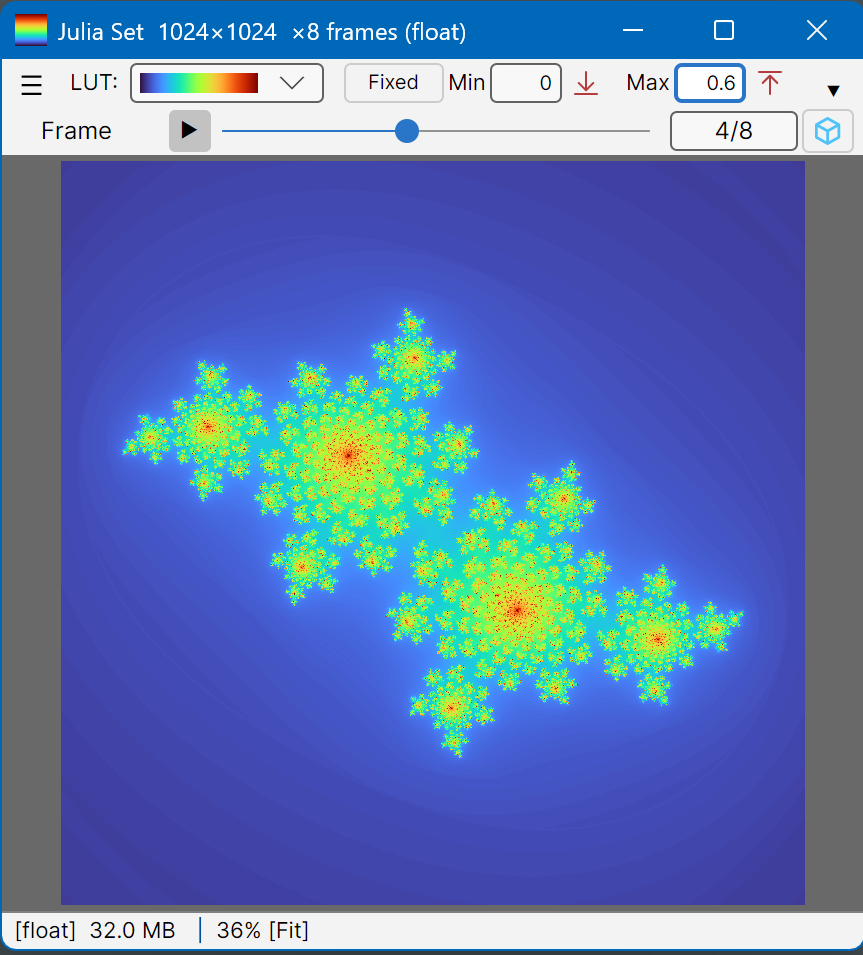
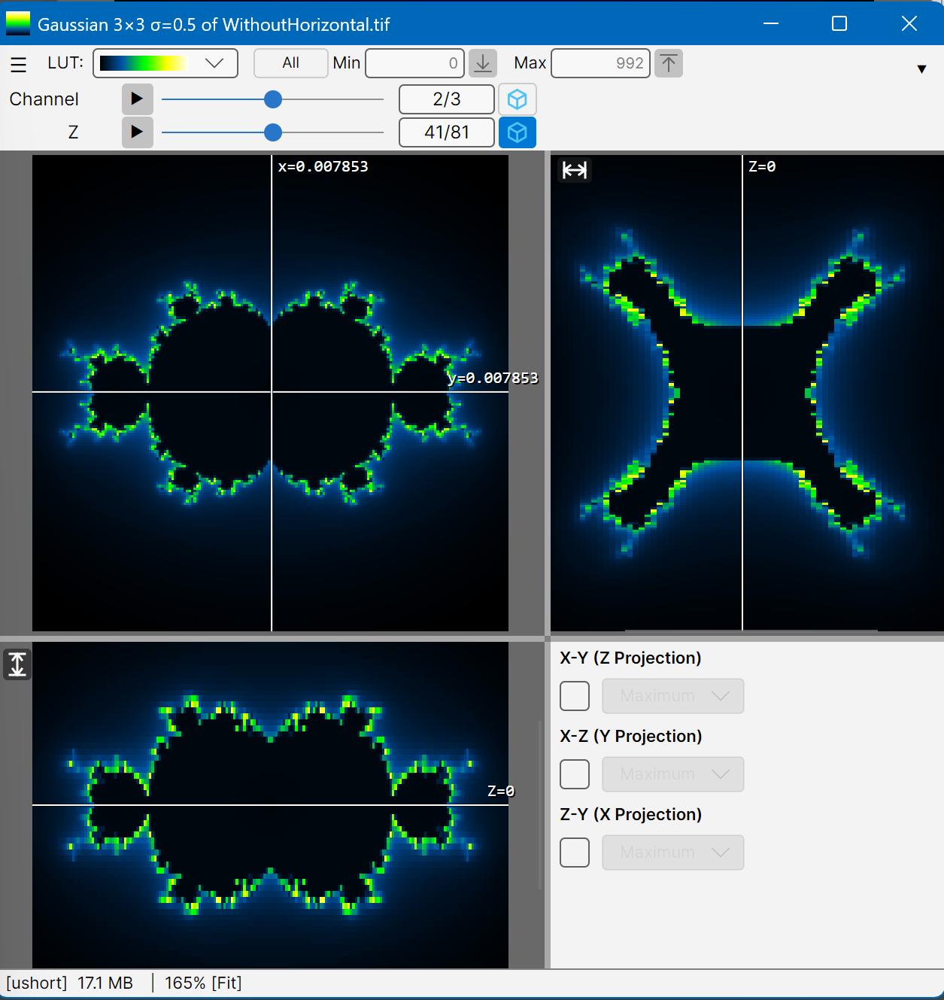
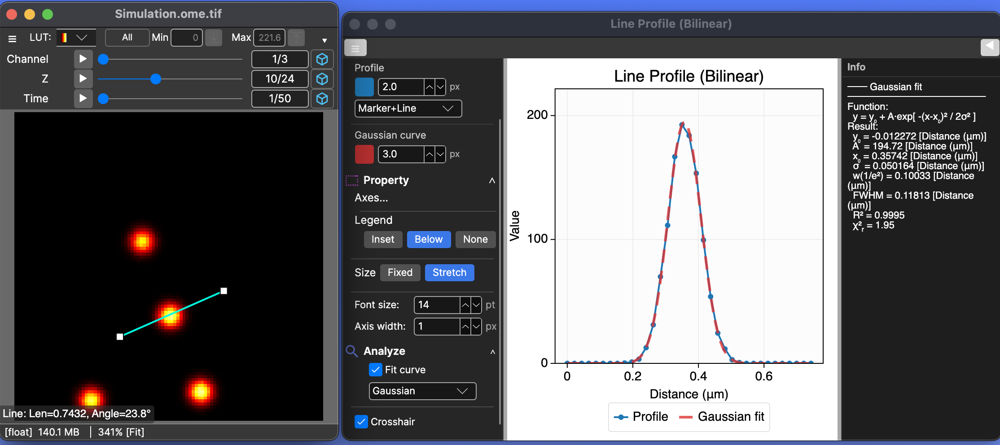

<div align="right">
  
</div>

<div align="center">

# MxPlot

**High-Performance Multi-Axis Matrix Visualization Ecosystem**

[](https://dotnet.microsoft.com/)
[](https://github.com/u1bx0/mxplot/releases)

[](LICENSE)

<p>
  <b>A unified suite of libraries for handling complex scientific and engineering datasets.</b>
</p>
</div>

**MxPlot** is a modular ecosystem for high-performance scientific data management and visualization.
It covers the full stack — from a dependency-free data engine (`MatrixData<T>`) to a cross-platform interactive viewer (`MxPlot.UI.Avalonia`, `MxPlot.App`) — enabling efficient handling of multi-dimensional datasets: XY matrices extended by Time, Z-Space, Channel, Wavelength, FOV, and more, with a focus on high throughput, physical coordinate integrity, and seamless UI binding.

<div align="center">
   
   
  
</div>


## 🚀 Just a Quick Look at the Code
```csharp
// You can create a multi-dimensional data with physical coordinates
var md = new MatrixData<double>(
    Scale2D.Centered(512, 512, 4, 4),
    Axis.Channel(3), Axis.Z(32, -5, 5, "µm"),Axis.Time(100, 0, 10, "s"));

// Easy access to each frame 
md.ForEach((i, array) => // array is the internal T[] of the frame at index i
{
    var (c, z, t) = md.Dimensions.GetAxisValuesStruct(i);
    SetByYourOwnFunction(array, c, z, t);
});
```
More details are provided below.

## 🏗️ Repository Structure

This repository hosts the **MxPlot ecosystem**, organized into the following library suite:

- **MxPlot (Metapackage)**: A convenient entry point that bundles the core, UI layer, and common extensions.
- **MxPlot.Core**: The foundational, dependency-free data engine (`MatrixData<T>`).
- **MxPlot.UI.Avalonia**: Cross-platform visualization library built on [Avalonia UI](https://avaloniaui.net/). Runs on Windows, macOS, and Linux. Embeddable from WinForms or WPF via `MxPlotHostApplication`.
- **MxPlot.Extensions.Tiff / .Hdf5**: Specialized high-performance file I/O packages.
- **MxPlot.Extensions.Fft**: FFT processing utilities.
- **MxPlot.Extensions.Images**: Image loading utilities.
- **MxPlot.App** *(included in this repository)*:

At its heart, **MatrixData\<T\>** serves as the central engine, engineered to maximize data throughput.
The visualization layer (**MxPlot.UI.Avalonia**) is deliberately separated from the core to keep `MxPlot.Core` dependency-free, while still providing a rich, ready-to-use UI for immediate data exploration.
I hope this package serves as a robust foundation for your own novel applications!

> 💡 Modern AI-assisted development tools—such as GitHub Copilot with selectable models and other AI assistants—are used throughout this project as part of the standard workflow.


## 🎯 What is Multi-Axis Data?

Multi-axis data refers to datasets organized along multiple independent dimensions beyond simple 2D matrices such as:

- **Time-series microscopy**: `[X, Y]` with `[Time, Z, Channel]`
- **Hyperspectral imaging**: `[X, Y]` with `[Wavelength, Time]`
- **Multi-FOV (Tiling) scanning**: `[X, Y]` with`[FOV, Z, Time]`
- **Sensor arrays**: `[X, Y]` with `[Sensor, Frequency, Time]`

MxPlot.Core handles arbitrary axis combinations while maintaining physical coordinates, units, and metadata integrity.

## ✨ Features

### MxPlot.Core
- 🎯 **Multi-Axis Management**: Flexible dimension definition with physical coordinates and units
- 🔐 **Type Safety**: Full support for all numeric types including `Complex` and user-defined structures
- 📊 **Dimensional Operators**: Transpose, map, reduce, slice at frame, extract along axis, select by axis
- 🧊 **Volumetric Manipulation**: 3D volume access with projections (Max/Min/Mean) and restacking along x, y, and z axes
- 🚀 **High Performance**: Parallel and SIMD optimization, as well as Generic Math (.NET 10)
- 💾 **Virtual Frame Streaming**: MMF-backed on-demand loading for large files (>2 GB) — peak memory stays near one frame regardless of total size
- 🧪 **Scientific-Friendly Formats**: OME-TIFF, ImageJ-hyperstack TIFF, HDF5, FITS, CSV, and native `.mxd`
- 📂 **Format Plugin Registry**: Auto-discovers `MxPlot.Extensions.*.dll` at startup — no explicit registration required
- 🔬 **Spatial Filtering**: Median, Gaussian, and Mean kernels via the `IFilterKernel` plugin interface
- 📏 **Line Profile Extraction**: Arbitrary-angle intensity profiles with bilinear interpolation
- 🧮 **Arithmetic Operations**: Element-wise add, subtract, multiply, divide

### MxPlot.UI.Avalonia
- 🖥️ **Cross-Platform Viewer**: Runs on Windows, macOS, and Linux via **Avalonia UI 11.3** (Avalonia 11 / 12 have breaking API differences; the current release targets Avalonia 11.3.14)
- 🔭 **MatrixPlotter**: Full-featured standalone window — LUT selector, value-range bar, overlay manager, axis trackers, orthogonal views, profile plot, crop/sync/export
- 🖼️ **MxView**: Low-level Avalonia image surface — pan, zoom, SkiaSharp bitmap rendering
- 🔗 **WinForms / WPF Embedding**: `MxPlotHostApplication` lets you open `MatrixPlotter` windows from an existing WinForms or WPF app with minimal setup
- ✏️ **Interactive Overlays**: Line, Rectangle, Oval, Targeting, and Text shapes — drawn via right-click menu or API, with live statistics and profile plots

**Coming in next release:**
- 🎨 **Composite Rendering**: Multi-channel display with per-channel LUT — assign independent colors to each channel frame and composite them into a single view, as commonly used in fluorescence microscopy

## 📦 Installation

This ecosystem is provided as several NuGet packages.

- **MxPlot (Recommended)**: For most users. Includes the core engine, UI layer, and common extensions.
```bash
dotnet add package MxPlot --version 0.1.0-beta
```

- **MxPlot.Core**: For developers building their own tools without extra dependencies.
```bash
dotnet add package MxPlot.Core --version 0.1.0-beta
```

- **MxPlot.UI.Avalonia**: If you only need the visualization layer (e.g., for WinForms/WPF host apps).
```bash
dotnet add package MxPlot.UI.Avalonia --version 0.1.0-beta
```

Or add to your project file:

```xml
<PackageReference Include="MxPlot" Version="0.1.0-beta" />
```

### 🛠️ For Developers (Manual Setup)

If you want to modify the source code, clone the repository and reference the projects directly:

```Bash
git clone https://github.com/u1bx0/MxPlot.git
```
Then add project references to `MxPlot.Core.csproj` and `MxPlot.UI.Avalonia.csproj` in your solution.

### **Requirements**

- .NET 10.0 or .NET 8.0
- `MxPlot.UI.Avalonia` requires **Avalonia 11.3.x** (host projects must pin `Avalonia.Win32` / `Avalonia.Skia` to the same version)


## 🗿 Design Concepts and Philosophy
**MxPlot** is designed not as a general-purpose math library, but as a backend for scientific visualization.
- **Stateful "Active Cursor"**: `MatrixData<T>` maintains an internal state as a property of `ActiveIndex`, enabling seamless binding to UI sliders without external state management.
- **Structure over Algebra**: Focuses on high-performance memory management, slicing, and reshaping of multi-dimensional data. Complex linear algebra is left to dedicated libraries.
- **Pixel-Centered Coordinates**: Physical scaling measured on pixel centers (i.e. pixel size (or step) = (x<sub>max</sub> - x<sub>min</sub>) / (num - 1)).
- **Left-Bottom Origin**: Coordinate origin is at the left-bottom corner (Y increases upwards).
- **Immutable Matrix Size**: Matrix dimensions are fixed after creation for performance.
- **Backing IList<T[]>**: Uses `IList<T[]>` for frame storage, allowing both in-memory arrays and MMF-backed virtual frames behind a unified interface.
- **Reactive Cache Synchronization**: Statistics (min/max) are synchronized via shared list references across shallow copies, ensuring data integrity without redundant calculations.
- **Transparent Virtual Access**: Frames may live in RAM, on disk (MMF), or anywhere else — the API never changes.

## 🚀 Quick Start

### Basic 2D Matrix

```csharp
using MxPlot.Core;

// Create a 2D matrix with physical coordinates
var md = new MatrixData<double>(100, 100);
md.SetXYScale(-10, 10, -10, 10); // Physical range: -10 mm to +10 mm
md.XUnit = "mm";
md.YUnit = "mm";

// Set data using a lambda function: (ix, iy) refers to pixel indices, (x, y) to physical coordinates
md.Set((ix, iy, x, y) => Math.Sin(x) * Math.Cos(y));

// You can dirctly access the internal array (the most efficient)
double[] array = md.GetArray(); // Get the frame and access each element by array[iy * md.XCount + ix]

// Get statistics
var (min, max) = md.GetMinMaxValues();
Console.WriteLine($"Value range: [{min:F2}, {max:F2}]");
```

### Multi-Axis Data (e.g. 3D Time-series - 5D)

```csharp
using MxPlot.Core;
using MxPlot.Core.IO;

// Create 512×512 images with 10 Z-slices and 20 time points (200 frames total)
var data = new MatrixData<ushort>(
    Scale2D.Centered(512, 512, 10, 10), //X and Y have data coordinates with -5 to 5.
    Axis.Z(10, 0, 50, "µm"),        // Z: 0-50µm, 10 slices (unit is omissible)
    Axis.Time(20, 0, 10, "s")       // Time: 0-10 seconds, 20 frames
);

// Access specific frame (Z=5, Time=10)
data["Z"].Index = 5;
data["Time"].Index = 10;
// ushort[] for the selected frame
var frame = data.GetArray(); // Get current frame (Z=5, Time=10)

// Extract 3D data at specific Z-depth
var timeSeriesAtZ3 = data.SelectBy("Z", 3); // Returns MatrixData<ushort> with Time axis

// Save to compressed binary format
MatrixDataSerializer.Save("data.mxd", data, compress: true);

// Load without knowing the type
IMatrixData loaded = MatrixDataSerializer.LoadDynamic("data.mxd");
```

### Visualize in One Line (MxPlot.UI.Avalonia)

```csharp
using MxPlot.Core;
using MxPlot.UI.Avalonia.Views;

// Open a standalone MatrixPlotter window — works from console, WinForms, or WPF
MatrixPlotter.Create(data, title: "My Data").Show();
```

For **WinForms / WPF** host applications, initialize Avalonia once at startup and then call `MatrixPlotter.Create` from anywhere:

```csharp
// Program.cs (WinForms) — add Avalonia.Win32 + Avalonia.Skia NuGet packages to the host project
// ⚠️ These packages must match the Avalonia version used by MxPlot.UI.Avalonia (11.3.14).
//    A version mismatch causes a hard crash before Main() is reached.
AppBuilder.Configure<MxPlotHostApplication>()
    .UseWin32().UseSkia()
    .SetupWithoutStarting();

// Then, from any button click or event handler:
MatrixPlotter.Create(myData, title: "Result").Show();
```

> **Note on Avalonia versions**: `MxPlot.UI.Avalonia` currently targets **Avalonia 11.3.14**.
> Avalonia 11 and Avalonia 12 have significant breaking API changes.
> When adding `Avalonia.Win32` / `Avalonia.Skia` to a host project, always pin them to the same minor version (`11.3.x`).
> Avalonia 12 support is planned for a future release.

## 🎯 Key Features

### Multi-Axis Data Management

MxPlot.Core's **DimensionStructure** enables flexible multi-axis data organization:

```csharp
// Example: Hyperspectral Time-series Imaging
// Structure: [X, Y] × [Wavelength, Time, FOV]
var scale = new Scale2D(1024, -50, 50, 1024, -50, 50); // µm
var hyperData = new MatrixData<double>(scale,
    new Axis(31, 400, 700, "Wavelength"), // 400-700 nm, 31 channels
    Axis.Time(100, 0, 10, "s"),           // 10 seconds, 100 frames
    new FovAxis(4, 2)                      // 4×2 tiled FOV array with 8 tiles
);

// Total frames: 31 × 100 × 8 = 24,800 frames
Console.WriteLine($"Total: {hyperData.FrameCount} frames");

// Navigate axes
hyperData["Wavelength"].Index = 15; // 550nm
hyperData["Time"].Index = 50;       // 5 seconds
hyperData["FOV"].Index = 3;         // FOV tile [1,0]

// Extract data along specific axis
var timeSeriesAt550nm = hyperData.ExtractAlong("Time", 
    fixedCoords: new[] { 15, 0, 0 }); // Wavelength=15, FOV=0

// Get min/max across all time points at specific wavelength
var (minVal, maxVal) = hyperData.GetValueRange("Time", 
    fixedCoords: new[] { 15, 0, 0 });
```

### ⚙️ Element-wise Operations (The best way to process pixel data)

The recommended way to initialize or set the 5D matrix data efficiently is to use array data (T[]) directly.

```csharp
//Define 5D matrix data with Channel, Z, Time axes
var axes = new Axis[] { 
    Axis.Channel(3), //ch value= 0 - 2
    Axis.Z(11, -2, 2), 
    Axis.Time(21, 0, 20) 
};
//Note: Axif.Channel, .Z, .Time, .Frame are built-in axis types.
//          Otherwise use: new Axis(num, min, max, "name");

var scale = Scale2D.Centered(201, 201, 4, 4); // -2 to 2 for both X and Y
var md = new MatrixData<double>(scale, axes);

// Function providing the pixel value at (x,y,c,z,t)
double PixelValue(double x, double y, double c, double z, double t)
{
    //just example
    return x * y * c * z * t;
}

//  ================================//
// Set the value to each pixel at each frame
md.ForEach((i, array) => //parallel option is true by default
{
    //Axis values at the frame index i are returned as the order of axes.
    var (c, z, t) = md.Dimensions.GetAxisValuesStruct(i);
    //Best way to calculate the xy position from the array index
    for (int iy = 0; iy < scale.YCount; iy++)
    {
        double y = scale.YValue(iy); //physical position (md.YValue(iy) is also available.)
        int offset = iy * scale.XCount; //to access the array index directly
        for (int ix = 0; ix < scale.XCount; ix++)
        {
            double x = scale.XValue(ix); //physical position (md.XValue(ix) is also available.)
            //Evaluation of the value at (x, y, c, z, t)
            double val = PixelValue(x, y, c, z, t);
            //Set the value to the pixel
            array[offset + ix] = val;
        }
    }
}); //After ForEach action, the min and max values at each frame are updated automatically.

// =================================//
// If you like more simplified expression,
// (But this way may be a bit slower than the previous one.)
Enumerable.Range(0, md.FrameCount).AsParallel().ForAll( i =>
{
    var (c, z, t) = md.Dimensions.GetAxisValuesStruct(i);
    //Each point is iterated sequentially.
    md.Set(i, (ix, iy, x, y) => PixelValue(x, y, c, z, t));
});  
```
### 🔧 Primitive Arithmetic Operations

```csharp
// Background subtraction (common in microscopy)
var signal = new MatrixData<double>(512, 512);
var background = new MatrixData<double>(512, 512);
var corrected = signal.Subtract(background);

// Flat-field correction
var flatField = new MatrixData<double>(512, 512);
var normalized = signal.Divide(flatField);

// Gain and offset correction
var gainCorrected = signal.Multiply(1.5);         // Gain: ×1.5
var offsetCorrected = signal.Add(-100);  // Offset: -100
```

### 📊 Complex Number Support

```csharp
using System.Numerics;

var fftResult = new MatrixData<Complex>(256, 256);
fftResult.Set((ix, iy, x, y) => new Complex(x, y));

// Complex-specific statistics
var (magMin, magMax) = fftResult.GetMinMaxValues(0, ComplexValueMode.Magnitude);
var (phaseMin, phaseMax) = fftResult.GetMinMaxValues(0, ComplexValueMode.Phase);
var (powerMin, powerMax) = fftResult.GetMinMaxValues(0, ComplexValueMode.Power);
```

### 💾 Unified File I/O (Core + Extensions)
MxPlot handles multi-dimensional data with a flexible, format-agnostic API. By adding extensions, you can bridge MxPlot with professional scientific software.

```csharp
using MxPlot.Core;
using MxPlot.Core.IO;
using MxPlot.Extensions.Tiff;  // For OME-TIFF

// --- Saving: Choose your format ---
var matrix = new MatrixData<float>(
        Scale2D.Centered(512,512,2,2), 
        Axis.Channel(3), 
        Axis.Time(10, 0, 1, "s")); // XY + 3 Channels + 10 Timepoints

// Native format (fast, compact, supports virtual MMF loading)
matrix.SaveAs("data.mxd", new MxBinaryFormat());

// OME-TIFF (compatible with Fiji/ImageJ and bio-imaging software)
matrix.SaveAs("result.ome.tif", new OmeTiffFormat());

// --- Virtual loading: open a 15 GB file without loading it into RAM ---
var format = new OmeTiffFormat { LoadingMode = LoadingMode.Virtual };
var big = MatrixData<ushort>.Load("big_stack.ome.tif", format);
// big.IsVirtual == true: frames are decoded from MMF only on access

// --- Loading: Dynamic and type-safe ---
IMatrixData data = MatrixDataSerializer.LoadDynamic("data.mxd");
Console.WriteLine($"Dimensions: {data.Dimensions}"); // e.g., "512x512, C:3, T:10"

if (data is MatrixData<float> floatData)
{
    float val = floatData.GetValueAt(0, 0);
}
```

### 📐 Data Processing

```csharp
using MxPlot.Core;
using MxPlot.Core.Processing;

// === DimensionalOperator: Multi-dimensional data manipulation ===

// Transpose (swap X and Y axes for all frames)
var transposed = matrix.Transpose();

// Crop by pixel coordinates
var cropped = matrix.Crop(startX: 25, startY: 25, width: 50, height: 50);

// Crop by physical coordinates
var physicalCrop = matrix.CropByCoordinates(xMin: -5, xMax: 5, yMin: -5, yMax: 5);

// Center crop
var centered = matrix.CropCenter(width: 50, height: 50);

// Slice at the specific indices (params of tuple: (axisName, index))
var timeSlice = data.SliceAt(("Time", 10)); // 2D image from XYT

// Extract data along specific axis (creates new MatrixData with a single axis)
var zStackAtTime5 = data.ExtractAlong("Z", new[] { 0, 5 }); // Extract Z-stack (3D) at Time=5

// Snap to specific axis value (reduces dimension by 1)
var snapShot = data.SnapTo("Z", 2); // Extract hyperstack at Z=2 (N-1D)

// Map: Apply function to each pixel across all frames
var normalized = matrix.Map<double, double>((value, x, y, frame) => value / 255.0);

// Reduce: Aggregate across frame axis
var averaged = timeSeries.Reduce((x, y, values) =>
{
    double sum = 0;
    foreach (var v in values) sum += v;
    return sum / values.Length;
});

// === VolumeAccessor: 3D volume operations and projections ===

var volume = data.AsVolume("Z");

// Create orthogonal projections
var projMaxZ = volume.CreateProjection(ViewFrom.Z, ProjectionMode.Maximum); // MIP along Z
var projMaxX = volume.CreateProjection(ViewFrom.X, ProjectionMode.Maximum); // YZ plane
var projMaxY = volume.CreateProjection(ViewFrom.Y, ProjectionMode.Maximum); // XZ plane

// Simultaneous XZ + YZ extraction in one memory pass (zero-allocation buffer reuse)
var (xzPlane, yzPlane) = data.Apply(new SliceOrthogonalOperation(X: 128, Y: 128));

// Restack volume for different viewing axes
var restackedX = volume.Restack(ViewFrom.X);

// Direct voxel access (no bounds checking for performance)
double voxelValue = volume[x: 10, y: 20, z: 5];

// === LineProfileExtractor: Extract intensity profiles along arbitrary lines ===

var profile = matrix.Apply(new LineProfileOperation(
    startX: 10.5, startY: 20.3,
    endX: 80.7, endY: 90.2,
    numPoints: 100)); // Bilinear interpolation included

// === SpatialFilterOperation: Apply spatial filters ===

// Median filter 3×3
var medianFiltered = matrix.Apply(new SpatialFilterOperation(new MedianKernel(radius: 1)));

// Gaussian filter (radius=2, sigma=1.5)
var gaussFiltered = matrix.Apply(new SpatialFilterOperation(new GaussianKernel(radius: 2, sigma: 1.5)));
```

## 📖 More Detailed Information and Performance Reports

The detailed documentation and performance benchmark reports are available in the repository.

*However, it may be better to consult your AI agent to understand the usage and the ideas behind the implementation.*

> Hey, could you please tell me the details of the following library? - http://github.com/u1bx0/mxplot


## 🖥️ MxPlot.App — Standalone Scientific Viewer

**MxPlot.App** is a standalone data viewer application built on top of `MxPlot.UI.Avalonia`.
It provides a plug-in-driven open dialog, a multi-window dashboard, metadata editing, ROI statistics, line profile plots, and spatial filters — all without writing any code.

> 📦 **Pre-built binaries** (Windows x64 / macOS Apple Silicon) are available on the [Releases page](https://github.com/u1bx0/mxplot/releases).
> Source code is included in this repository under `MxPlot.App/

MxPlot.App also serves as a reference implementation showing how to build a full application on the MxPlot ecosystem.


## 📊 Version History

**v0.1.0-beta** (Major feature release — Virtual frames, plugin I/O, cross-platform UI, and standalone app)
- 💾 **Virtual Frame Streaming**: Introduced `VirtualFrames<T>` — MMF-backed on-demand frame loading for large files (>2 GB default threshold). Peak memory stays near one frame. Pluggable prefetch strategies keep navigation smooth.
- 🔌 **Format Plugin Registry**: `FormatRegistry` auto-discovers `MxPlot.Extensions.*.dll` at startup. Built-in formats (`MxBinaryFormat`, `CsvFormat`, `FitsFormat`) are always available; third-party formats are picked up with no explicit registration call.
- 📐 **New I/O Capability Interfaces**: `IProgressReportable`, `IVirtualLoadable`, `ICompressible` — format handlers declare their capabilities explicitly, enabling generic UI wiring (e.g. attaching a progress bar) without format-specific knowledge.
- ⚙️ **`LoadingMode` & `VirtualPolicy`**: `Auto / InMemory / Virtual` loading mode selection. `VirtualPolicy.ThresholdBytes` (default 2 GB) resolves `Auto` based on file size at runtime.
- 🗂️ **`.mxd` Format Overhaul**: Clarified binary layout, enabled direct MMF mount on uncompressed files, and added `CreateVessel<T>` factory + fast-path `SaveAs` (file-move + trailer rewrite, zero re-encode).
- 🧩 **`MatrixData<T>` Refactored into Partials**: Split into `Constructors`, `DataAccessors`, `Statistics`, and `Static` files. `_valueRangeMap` reference-sharing model ensures `Invalidate()` propagates correctly across shallow copies.
- 🎨 **Imaging Subsystem in Core**: `LookupTable` and `ColorThemes` (Grayscale, Hot, Cold, Spectrum, HiLo, and more) moved to `MxPlot.Core.Imaging` — no UI dependency needed for colormap access.
- 🔬 **Spatial Filters**: `MedianKernel`, `GaussianKernel`, `MeanKernel` via the `IFilterKernel` interface. Progress and cancellation supported.
- 📊 **Orthogonal Slice & Projection**: `SliceOrthogonalOperation` and `OrthogonalProjectionsOperation` — both XZ and YZ planes computed in a single memory pass, with zero-allocation buffer-reuse parameters.
- 🔭 **FITS Format**: New `FitsHandler` — standard FITS read/write with multi-HDU support and cancellation.
- 🖥️ **MxPlot.UI.Avalonia (New Package)**: Cross-platform visualization library on Avalonia 11. Includes `MxView` (pan/zoom image control), `MatrixPlotter` (full-featured plotter window), and `MxPlotHostApplication` for WinForms/WPF embedding.
- 📱 **MxPlot.App (New — included in this repository)**: Standalone scientific viewer with plugin-driven file open, multi-window dashboard, metadata editor, ROI statistics, and extensible analysis UI.
- ⚠️ **Breaking Changes**: `IOperation` → `IOperation<out TResult>` (generic `Apply<TResult>`); `Axis.MinMax` → `Axis.Range`; `OnDemand` terminology → `Virtual`; `IMatrixData.ValueType` removed.

**v0.0.5-alpha** (Improving the internal logic with breaking changes)
- 🧠 Frame Sharing & Memory Model: Refined the zero-cost O(1) frame reordering (Reorder) using underlying array reference sharing.
- 🔄 Explicit Copy Semantics: Clarified mutation semantics and introduced explicit deep copying via Duplicate() and Clone().
- ⚡ Lazy Min/Max Evaluation: Implemented lazy evaluation and caching for frame min/max values (GetValueRange), optimizing performance during bulk array mutations, which largely modified the internal logics of MatrixData.
- 📚 Comprehensive Documentation: Added and updated extensive Markdown guides for Core Operations, Frame Sharing Model, Volume Accessor, and Dimension Structure.

**v0.0.4-alpha** (Added new packages and introduced breaking changes)
- 🔌 Generic Bridge: Enabled non-generic layers (UI/ViewModels) to invoke strongly-typed image processing operations without compile-time knowledge of generic type `<T>`.
- 🛠 Visitor Pattern: Introduced `IMatrixData.Apply(IOperation)` as a unified dispatch entry point to dynamically resolve and execute Volume, Filter, and Dimensional operations.
- ➕ Added MxPlot.Extensions.Images package for useful image loading via SkiaSharp (PNG, JPEG, BMP, TIFF).
- ➕ Added MxPlot.Extensions.Fft package for 2D FFT processing via MathNet.Numerics.
- 🔄 Method Renaming (Breaking): Renamed `At` to `GetFrameIndexAt` in DimensionStructure.

**v0.0.3-alpha** (Some modifications and reorganization of packages)
- 🏗️ **Metapackage Structure**: Reorganized as a metapackage `MxPlot` bundling `MxPlot.Core` and common extensions for easier installation and management.
- 🔄 **Method Renaming**: Renamed `XAt`/`YAt` to **`XValue`/`YValue`** for better clarity and naming consistency.
- ➕ Added MxPlot.Extensions.Tiff and MxPlot.Extensions.HDF5 packages for specialized file I/O.
- 🏗️ **Type Optimization**: Changed `Scale2D` from `record struct` to **`readonly struct`** to ensure immutability and improve performance.
- ➕ **Added `GetAxisValues` / `GetAxisValuesStruct`**: Now supports deconstruction for more intuitive axis value retrieval.
- 🏗️ **Enhanced `IMatrixData`**: Implemented Facade pattern methods for `DimensionStructure`, simplifying the interface for complex data navigation.

**v0.0.2-alpha** (First core implementation)
- ✨ **NEW**: `VolumeAccessor<T>` — High-performance 3D volume operations with readonly struct.
- ⚡ **NEW**: `VolumeOperator` — Optimized volume projections with tiled memory access (2–3.4× speedup).
- 🎯 **ENHANCED**: `DimensionalOperator.ExtractAlong()` — Extract data along specific axis with multi-axis and ActiveIndex support.

**v0.0.1-alpha** (Package name reservation)
- Package name reserved on NuGet. No implementation (placeholder only).

**Initial Development (Pre-release)**
- Core multi-axis container with dimension management
- Binary I/O (.mxd) with compression
- Dimensional & cross-sectional operators
- Arithmetic operations with SIMD optimization
- OME-TIFF and ImageJ-compatible TIFF support via MxPlot.Extensions.Tiff packages
- HDF5 support via MxPlot.Extensions.HDF5 package

---
> **🚧 Disclaimer (IMPORTANT)🚧**
> This library is "over-engineered" by design, driven by AI tools.
> While I maintain it for my own purpose, I share it in the hope that it serves as a powerful engine for other developers.
> However, please be aware of potential bugs, as code testing is not yet complete.
>
> *Maintained by YK ([@u1bx0](https://github.com/u1bx0))*
