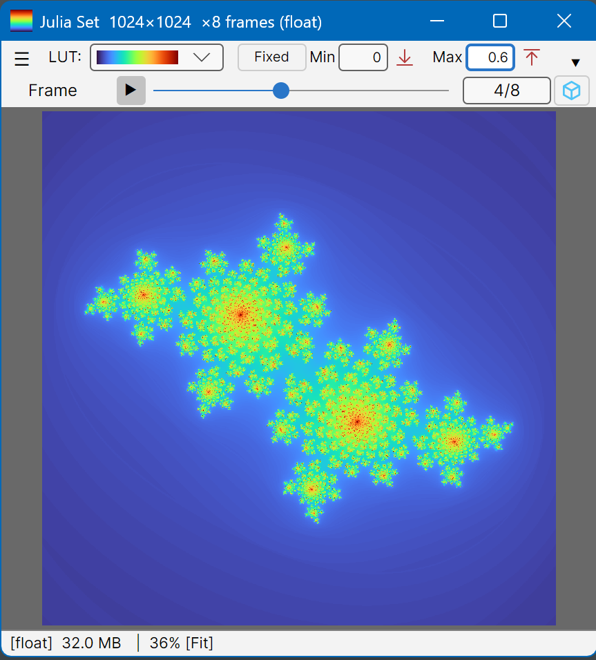
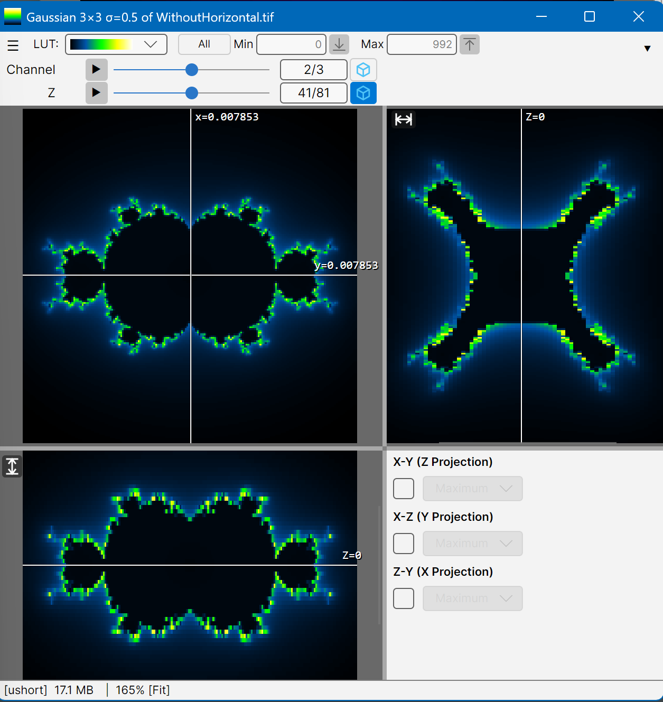
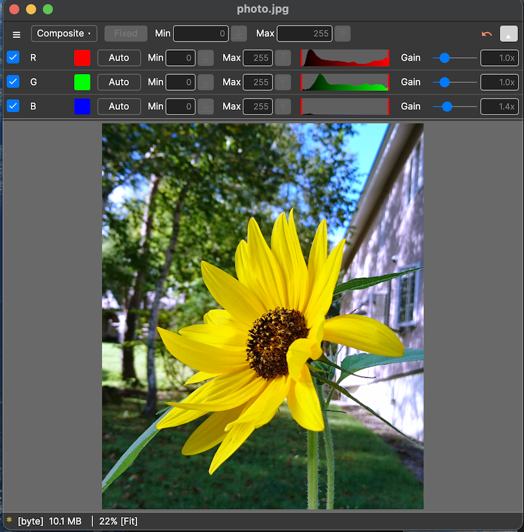
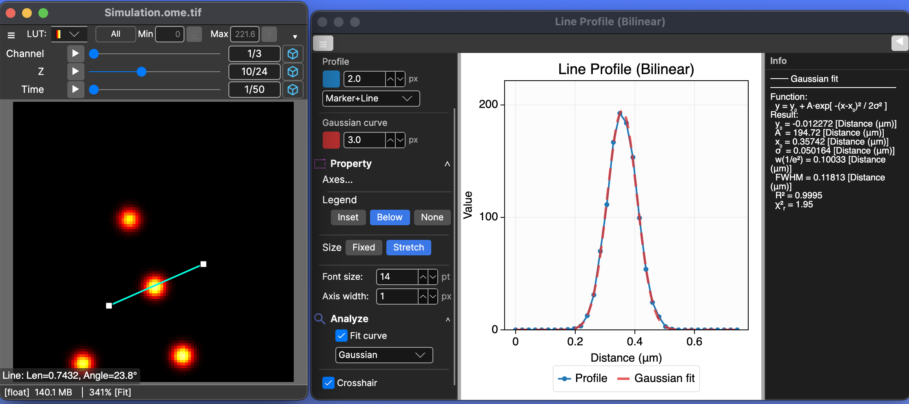
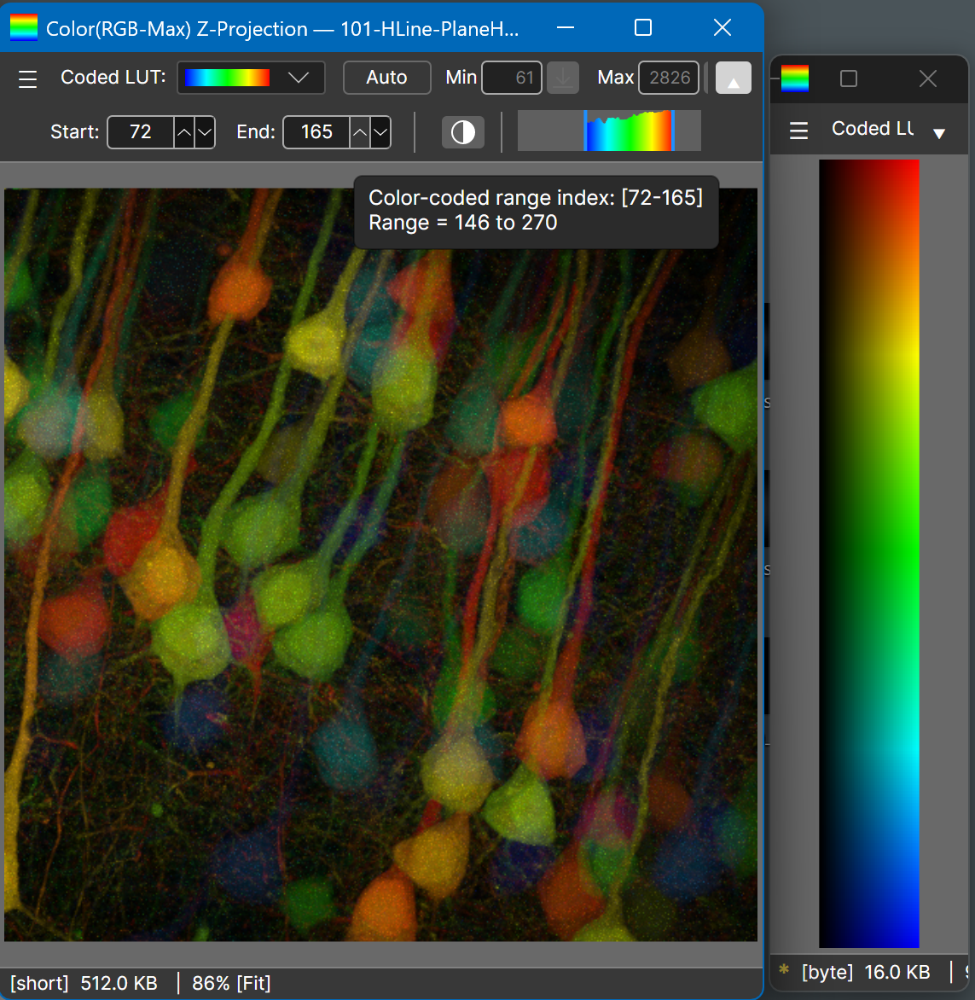

<div align="right">
  
</div>

<div align="center">

# MxPlot

**High-Performance Multi-Axis Matrix Visualization Ecosystem**

[](https://dotnet.microsoft.com/)
[](https://github.com/u1bx0/mxplot/releases)
[](https://www.nuget.org/packages/MxPlot)
[](LICENSE)

<p>
  <b>A unified suite of libraries for handling complex scientific and engineering datasets.</b>
</p>
</div>

**MxPlot** is a modular ecosystem for high-performance scientific data management and visualization.
It covers the full stack — from a dependency-free data engine (`MatrixData<T>`) to a cross-platform 
interactive viewer (`MxPlot.UI.Avalonia`, `MxPlot.App`) — enabling efficient handling of 
multi-dimensional datasets: XY matrices extended by Time, Z-Space, Channel, Wavelength, FOV, and more,
with a focus on high throughput, physical coordinate integrity, and seamless UI binding.

<div align="center">
   
   
    
  <br/>
    
  
    

</div>

---

## 🖥️ MxPlot.App — See What MxPlot Can Do

>  MxPlot.App is a fully-featured, cross-platform scientific viewer  
> that embodies the entire MxPlot library ecosystem in a single application.  
> It is also the **reference implementation** showing how to build on top of MxPlot.

| Feature | Description |
|:---|:---|
| 📂 Multi-format open | OME-TIFF, HDF5, FITS, CSV, `.mxd` and more via plugin |
| 🔭 Multi-axis navigation | Slice through Z, Time, Channel, Wavelength, FOV interactively |
| 📐 Orthogonal views | XZ / YZ projections and live cross-section display |
| ✏️ ROI & overlays | Line, Rectangle, Oval with live statistics |
| 📊 Built-in profile plots | Arbitrary-angle line profiles with Gaussian/Lorentzian fit |
| 🪟 Multi-window dashboard | Sync, tile, and link multiple datasets |
| 🧩 Processing menu | Filter, Normalize, Log Transform, FFT, Resample, Transpose and more — apply once, or keep a result live-synced to its source |
| ✂️ Crop / Substack | Extract Z-range or 3D volume regions |
| 🔌 Extensible | File formats and tools via plugin DLL, custom LUTs/colormaps by dropping in a palette file |


📦 **Pre-built binaries** (Windows x64 / macOS Apple Silicon) →
**[Download from Releases](https://github.com/u1bx0/mxplot/releases)**
&nbsp;·&nbsp;
📖 **[MxPlot.App Details](./MxPlot/MxPlot.App/README.md)**

---

## 🚀 Just a Quick Look at the Code

> MxPlot is first and foremost a **C# library**.  
> The same capabilities you see in MxPlot.App are fully accessible from your own application.

```csharp
// You can create a multi-dimensional data with physical coordinates
var md = new MatrixData<double>(
    Scale2D.Centered(512, 512, 4, 4),
    Axis.Channel(3), Axis.Z(32, -5, 5, "µm"),Axis.Time(100, 0, 10, "s"));

// Easy access to each frame 
md.ForEach((i, array) => // array is the internal T[] of the frame at index i
{
    var (c, z, t) = md.Dimensions.GetAxisValuesStruct(i);
    SetByYourOwnFunction(array, c, z, t);
});
```
More details are provided below.

## 🏗️ Repository Structure

This repository hosts the **MxPlot ecosystem**, organized into the following library suite:

- **MxPlot (Metapackage)**: A convenient entry point that bundles the core, UI layer, and common extensions.
- **MxPlot.Core**: The foundational, dependency-free data engine (`MatrixData<T>`).
- **MxPlot.UI.Avalonia**: Cross-platform visualization library built on [Avalonia UI](https://avaloniaui.net/). Runs on Windows, macOS, and Linux. Embeddable from WinForms or WPF via `MxPlotHostApplication`.
- **MxPlot.UI.Avalonia.Video**: Video export extension for `MxPlot.UI.Avalonia` — uncompressed AVI (via [SharpAvi](https://github.com/baSSiLL/SharpAvi)) and H.264 MP4 (via an external `ffmpeg`), plus a reusable base for adding further formats.
- **MxPlot.Extensions.Tiff / .Hdf5**: Specialized high-performance file I/O packages.
- **MxPlot.Extensions.Fft**: FFT processing utilities.
- **MxPlot.Extensions.Images**: Image loading utilities.
- **MxPlot.App** *(included in this repository)*: Standalone scientific viewer built on the full MxPlot stack. 
  See [🖥️ MxPlot.App](#️-mxplotapp--see-what-mxplot-can-do) above.

At its heart, **MatrixData\<T\>** serves as the central engine, engineered to maximize data throughput.
The visualization layer (**MxPlot.UI.Avalonia**) is deliberately separated from the core to keep `MxPlot.Core` dependency-free, while still providing a rich, ready-to-use UI for immediate data exploration.

## 🗿 Design Concepts and Philosophy
**MxPlot** is designed not as a general-purpose math library, but as a backend for scientific visualization.
- **A List of Frames**: Held internally as `IList<T[]>` — one flat 2D array per frame — enabling shared references and zero-copy, high-performance access.
- **Stateful "Active Cursor"**: `MatrixData<T>` maintains an internal state as a property of `ActiveIndex`, enabling seamless binding to UI sliders without external state management.
- **Structure over Algebra**: Focuses on high-performance memory management, slicing, and reshaping of multi-dimensional data. Complex linear algebra is left to dedicated libraries.
- **Pixel-Centered Coordinates**: Physical scaling measured on pixel centers (i.e. pixel size (or step) = (x<sub>max</sub> - x<sub>min</sub>) / (num - 1)).
- **Left-Bottom Origin**: Coordinate origin is at the left-bottom corner (Y increases upwards).
- **Immutable Matrix Size**: Matrix dimensions are fixed after creation for performance.
- **Reactive Cache Synchronization**: Statistics (min/max) are synchronized via shared list references across shallow copies, ensuring data integrity without redundant calculations.
- **Transparent Virtual Access**: The frame-list design enables frames to live in RAM, on disk (MMF), or anywhere else — the API never changes.

## ✨ Features

### MxPlot.Core
- 🎯 **Multi-Axis Management**: Flexible dimension definition with physical coordinates and units
- 🔐 **Type Safety**: Full support for all numeric types including `Complex` and user-defined structures
- 📊 **Dimensional Operators**: Transpose, map, reduce, slice at frame, extract along axis, select by axis
- 🧊 **Volumetric Manipulation**: 3D volume access with projections (Max/Min/Mean) and restacking along x, y, and z axes
- 🚀 **High Performance**: Parallel and SIMD optimization, as well as Generic Math (.NET 10)
- 💾 **Virtual Frame Streaming**: MMF-backed on-demand loading for large files (>2 GB) — peak memory stays near one frame regardless of total size
- 🧪 **Scientific-Friendly Formats**: OME-TIFF, ImageJ-hyperstack TIFF, HDF5, FITS, CSV, and native `.mxd`
- 📂 **Format Plugin Registry**: Auto-discovers `MxPlot.Extensions.*.dll` at startup — no explicit registration required
- 🔬 **Spatial Filtering**: Median, Gaussian, and Mean kernels via the `IFilterKernel` plugin interface
- 📏 **Line Profile Extraction**: Arbitrary-angle intensity profiles with bilinear interpolation
- 🧮 **Arithmetic Operations**: Element-wise add, subtract, multiply, divide

### MxPlot.UI.Avalonia
- 🖥️ **Cross-Platform Viewer**: Runs on Windows, macOS, and Linux via **Avalonia UI 11.3** (Avalonia 11 / 12 have breaking API differences; the current release targets Avalonia 11.3.18)
- 🔭 **MatrixPlotter**: Full-featured standalone window — LUT selector, value-range bar, overlay manager, axis trackers, orthogonal views, profile plot, crop/sync/export
- 🖼️ **MxView**: Low-level Avalonia image surface — pan, zoom, SkiaSharp bitmap rendering
- 🔗 **WinForms / WPF Embedding**: `MxPlotHostApplication` lets you open `MatrixPlotter` windows from an existing WinForms or WPF app with minimal setup
- ✏️ **Interactive Overlays**: Line, Rectangle, Oval, Targeting, and Text shapes — drawn via right-click menu or API, with live statistics and profile plots
- ✂️ **Substack / 3D Crop**: Extract a Z-range substack or crop a full 3D volume region — with sync-group support across linked windows
- 💾 **File Session Management**: Unsaved-change tracking (`DirtyFlags`), close confirmation dialog, and `SaveAsAsync` / `DuplicateAsync` APIs for programmatic control
- 🎨 **Composite Rendering**: Multi-channel display with per-channel color, contrast, gain and gamma — as commonly used in fluorescence microscopy. RGB color images open composited automatically, and can be converted back to grayscale. See the [Composite Rendering Guide](./docs/MatrixPlotter_Composite_Guide.md)
- 🌈 **Color-Coded Rendering**: Live depth/time colour-coded projection in a linked child window, with a drag-to-narrow depth histogram and adjustable palette
- 🎛️ **External Control**: Drive the displayed LUT and value range from host code through Facade properties (`plotter.Lut`, `plotter.RangeMode`, `plotter.FixedRange`) — see the [MatrixPlotter Usage Guide](./docs/MatrixPlotter_Usage_Guide.md)
- 📜 **Scripting (`MxPlotScriptHost`)**: Open MatrixPlotter windows from .NET 10 file-based apps (`dotnet run app.cs`), console tools, or notebook cells — no host application required. `Run(script)` starts the message loop, runs your script off the UI thread, and returns when every window it opened has closed. See [MatrixPlotter Usage Guide § Scripting with MxPlotScriptHost](./docs/MatrixPlotter_Usage_Guide.md)

📖 For tutorials, pipeline examples, and every other guide, see the **[Documentation Index](./docs/README.md)** — start with the **[MatrixData Operations Guide](./docs/MatrixData_Operations_Guide.md)**.

## 📦 Installation

This ecosystem is provided as several NuGet packages.

- **MxPlot (Recommended)**: For most users. Includes the core engine, UI layer, and common extensions.
```bash
dotnet add package MxPlot
```

> *WinForms / WPF host apps additionally require `Avalonia.Win32` and `Avalonia.Skia`.  
> Pin them to the same version as `MxPlot.UI.Avalonia` uses (`11.3.18`).  
> See [Integration Guide](./docs/MatrixPlotter_NonAvalonia_Integration_Guide.md).*

- **MxPlot.Core**: For developers building their own tools without extra dependencies.
```bash
dotnet add package MxPlot.Core
```

### 🛠️ For Developers (Manual Setup)

If you want to modify the source code, clone the repository and reference the projects directly:

```Bash
git clone https://github.com/u1bx0/MxPlot.git
```
Then add project references to `MxPlot.Core.csproj` and `MxPlot.UI.Avalonia.csproj` in your solution.

### Requirements

- .NET 10.0 or .NET 8.0
- `MxPlot.UI.Avalonia` requires **Avalonia 11.3.x** (host projects must pin `Avalonia.Win32` / `Avalonia.Skia` to the same version)

## 📝 Some Examples

### Basic 2D Matrix

```csharp
using MxPlot.Core;

// Create a 2D matrix with physical coordinates
var md = new MatrixData<double>(100, 100);
md.SetXYScale(-10, 10, -10, 10); // Physical range: -10 mm to +10 mm
md.XUnit = "mm";
md.YUnit = "mm";

// Set data using a lambda function: (ix, iy) refers to pixel indices, (x, y) to physical coordinates
md.Set((ix, iy, x, y) => Math.Sin(x) * Math.Cos(y));

// You can dirctly access the internal array (the most efficient)
double[] array = md.GetArray(); // Get the frame and access each element by array[iy * md.XCount + ix]

// Get statistics
var (min, max) = md.GetMinMaxValues();
Console.WriteLine($"Value range: [{min:F2}, {max:F2}]");
```

### Multi-Axis Data (e.g. 3D Time-series - 5D)

```csharp
using MxPlot.Core;
using MxPlot.Core.IO.Formats;

// Create 512×512 images with 10 Z-slices and 20 time points (200 frames total)
var data = new MatrixData<ushort>(
    Scale2D.Centered(512, 512, 10, 10), //X and Y have data coordinates with -5 to 5.
    Axis.Z(10, 0, 50, "µm"),        // Z: 0-50µm, 10 slices (unit is omissible)
    Axis.Time(20, 0, 10, "s")       // Time: 0-10 seconds, 20 frames
);

// Access specific frame (Z=5, Time=10)
data["Z"].Index = 5;
data["Time"].Index = 10;
// ushort[] for the selected frame
var frame = data.GetArray(); // Get current frame (Z=5, Time=10)

// Extract 3D data at specific Z-depth
var timeSeriesAtZ3 = data.SelectBy("Z", 3); // Returns MatrixData<ushort> with Time axis

// Save to compressed binary format
MatrixDataSerializer.Save("data.mxd", data, compress: true);

// Load without knowing the type
IMatrixData loaded = MatrixDataSerializer.LoadDynamic("data.mxd");
```

### Visualize in One Line (MxPlot.UI.Avalonia)

```csharp
using MxPlot.Core;
using MxPlot.UI.Avalonia.Views;

// Open a standalone MatrixPlotter window — works from console, WinForms, or WPF
MatrixPlotter.Create(data, title: "My Data").Show();
```

For **WinForms / WPF** host applications, initialize Avalonia once at startup and then call `MatrixPlotter.Create` from anywhere:

```csharp
// Program.cs (WinForms) — add Avalonia.Win32 + Avalonia.Skia NuGet packages to the host project
// ⚠️ These packages must match the Avalonia version used by MxPlot.UI.Avalonia (11.3.18).
//    A version mismatch causes a hard crash before Main() is reached.
AppBuilder.Configure<MxPlotHostApplication>()
    .UseWin32().UseSkia()
    .SetupWithoutStarting();
```

After that, MatrixPlotter.Create works from anywhere in your application:

```csharp
// Open a window with initial data:
var plotter = MatrixPlotter.Create(myData, title: "Result");
plotter.Show();

// To replace data in an existing window (e.g., live update loop),
// assign the new data on the Avalonia dispatcher thread:
await Avalonia.Threading.Dispatcher.UIThread.InvokeAsync(() =>
{
    plotter.MainView.MatrixData = newData;   // or: plotter.ViewModel.MatrixData = newData;
});

// ResumeSettingsEnabled = true carries over axis index and value-range settings
// when data is replaced, which is useful for continuous data acquisition.
plotter.ResumeSettingsEnabled = true;

// SaveAsAsync / DuplicateAsync are available for programmatic file operations:
await plotter.SaveAsAsync("output.ome.tif");
var clone = await plotter.DuplicateAsync(show: true);
```

> **Note on Avalonia versions**: `MxPlot.UI.Avalonia` currently targets **Avalonia 11.3.18**.
> Avalonia 11 and Avalonia 12 have significant breaking API changes.
> When adding `Avalonia.Win32` / `Avalonia.Skia` to a host project, always pin them to the same minor version (`11.3.x`).
> Avalonia 12 support is planned for a future release.

For **scripts, console tools, and notebook cells** — anything without a pre-existing UI loop — use `MxPlotScriptHost` instead:

```csharp
// app.cs — a .NET 10 file-based app (dotnet run app.cs)
#:package MxPlot@0.5.0

using MxPlot.Core;
using MxPlot.UI.Avalonia;

MxPlotScriptHost.Run(() =>
{
    var plotter = MxPlotScriptHost.Show(data, title: "My Data");
    // plotter and its properties are UI-thread affine; marshal through Invoke:
    var lutName = MxPlotScriptHost.Invoke(() => plotter.Lut?.Name);
});
// Run returns once every window opened by the script has closed.
```

For advanced usage of `MatrixPlotter`, see the **[MatrixPlotter Usage Guide](./docs/MatrixPlotter_Usage_Guide.md)**.


## 📊 Version History

**v0.5.0** (Lazy-decode Virtual backends, Processing command unification, FFT, Resample)
- 🗂️ **Lazy-Decode Virtual Backends**: Compressed multi-frame OME/ImageJ TIFF can now be opened Virtual, decoded frame by frame on demand — TIFFs beyond 32,767 frames now load, and large LZW-compressed stacks open dramatically faster than before.
- 🧩 **Processing Commands**: Every one-shot Processing/Conversion menu operation shares one implementation, offering "This frame only" / "Sync source data" / "Replace data" consistently. Menu regrouped into Data / Scale / Processing / Info tabs.
- 🌀 **FFT 2D (New)** and 📐 **Resample (New)**: Forward/inverse FFT and pixel-count resampling, both as ordinary menu commands with the same This-frame/Sync/Replace options.
- 📊 **All-Mode Range Scan** and 🔬 **Cache Monitor**: Large-dataset value-range scans now run in the background with Cancel; a new flat-grid cache view.
- 🐛 **Bug Fixes**: Composite/LUT-mode sync and header glitches; Sync-follower windows not redrawing or going stale on update; linked windows left pointing at dropped data.
- ⚠️ **Breaking Changes**: File-format layer moved to `MxPlot.Core.IO.Formats`; several Virtual-frame type renames; `IPlotterAction` → `IPlotterTool`; `Normalize`/`LogTransform` dropped their single-frame-index parameter. See [CHANGELOG.md](./CHANGELOG.md) for the full list.

**v0.4.0** (ROI View, Transpose, Composite/side-view consistency, and rendering performance)
- 🔍 **ROI View (New)**: "Open ROI View" opens a Rectangle/Oval overlay's enclosed region in its own synced window.
- 🔄 **Transpose**: Now a `MatrixPlotter` operation, streaming Virtual sources in RAM-bounded bands.
- 🎨 **Composite Consistency**: Auto/All ranges survive `Refresh()`, line profiles take channel colours, side views stay in sync.
- ⚡ **Composite RGB Fast Path**: `CompositeBitmapWriter` bypasses the general per-pixel path for byte/3-channel pure-RGB Fixed(0,255) recipes — a raw byte-interleave-speed render instead. New `CompositeRecipes` Facade property lets a host (e.g. a live camera) opt in explicitly.
- ⚡ **Rendering Performance**: Parallel LUT rendering (previously single-threaded), a redundant full-frame re-render on unchanged Composite recipes, and a histogram recompute that could livelock under a fast live feed — all fixed. New `Parallelism` control caps render threads per host.
- 🔌 **External Control**: `AllowDataReplace`/`AutoUpdateWindowIcon` host opt-outs; `ControlFactory` is now public.
- 📁 **LUTs Folder**: External palettes are now found by file-based apps (`dotnet run app.cs`) and macOS `.app` bundles.
- 🐛 **Bug Fixes**: Composite→LUT→Composite value-range loss, ColorThemes red/blue swap, region rounding/orientation, custom LUT levels, and more.
- ⚠️ **Breaking Changes**: `LookupTable`/`ColorThemes` moved to `MxPlot.UI.Avalonia.Rendering`; `IBitmapWriter` gained `ParallelPolicy`; plugin API renames. See [CHANGELOG.md](./CHANGELOG.md) for the full list.

**v0.3.0 and earlier** — Composite workflow completion, ColorCoded rendering, the `LinkedView` follower model, `MxPlotScriptHost`, MP4 export, and more. See [CHANGELOG.md](./CHANGELOG.md) for the full history.

---
> **⚠️ Note**
> This library is actively developed and maintained for my own research purposes,
> and shared in the hope that it serves as a useful foundation for others.
> Please be aware that testing is not yet exhaustive — use in production at your own risk.
>
> *Maintained by YK ([@u1bx0](https://github.com/u1bx0))*
