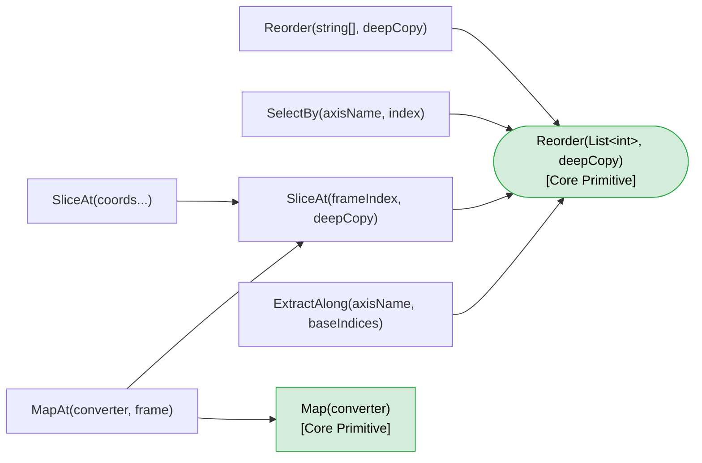
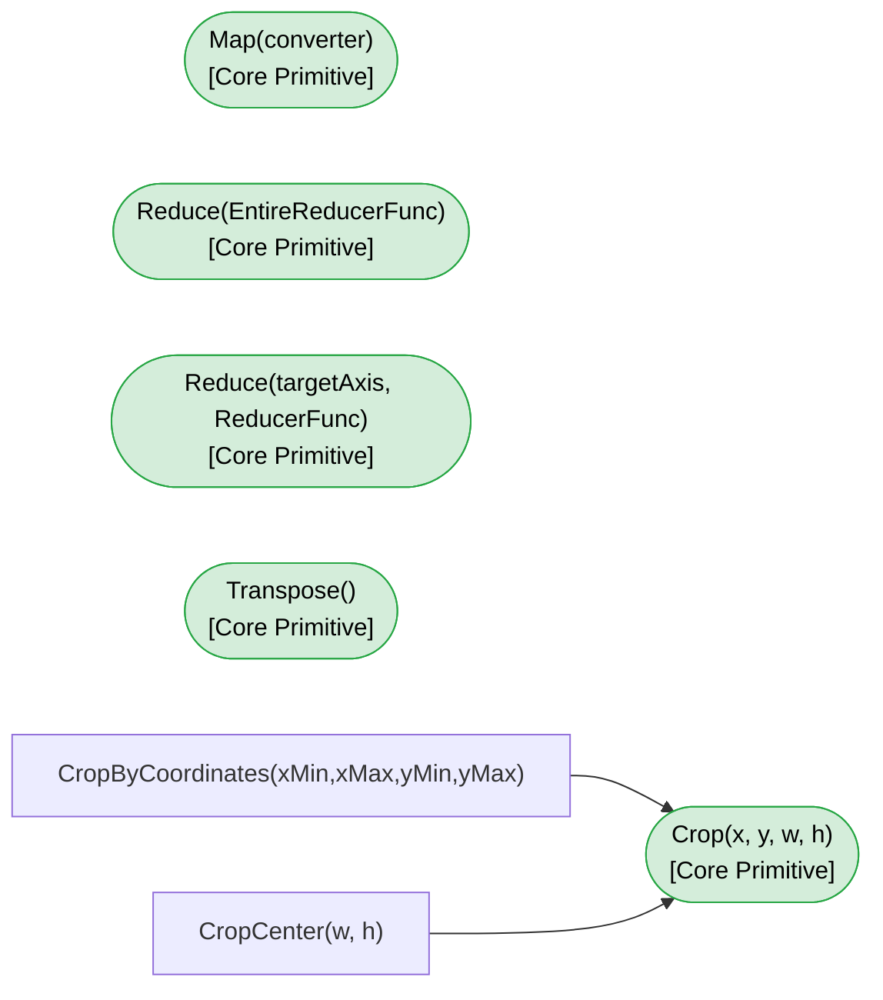
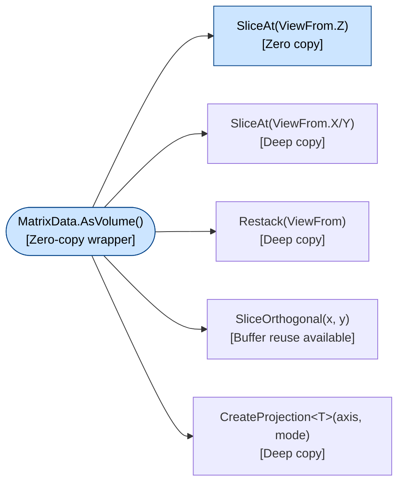

# MatrixData\<T\> Method Ecosystem Reference

**MxPlot.Core / MxPlot.Core.Processing — Call Map & Copy Strategy**

---

## Table of Contents

1. [Overview](#overview)
2. [Call Graph](#call-graph)
3. [Layer 0 — Data Access Primitives](#layer-0--data-access-primitives)
4. [Layer 1 — Core Generator Methods](#layer-1--core-generator-methods)
5. [Layer 2 — Composite Methods](#layer-2--composite-methods)
6. [Zero-Copy Usage Notes](#zero-copy-usage-notes)
7. [Quick Reference: Choose Your Method](#quick-reference-choose-your-method)

---

## Overview

The operation methods of `MatrixData<T>` are organized into three layers.

| Layer | Description |
|---|---|
| **Layer 0** | Data access primitives that do not create a new `MatrixData<T>` instance (`GetArray`, `AsSpan`, etc.) |
| **Layer 1** | Core generator methods that serve as the foundation called by other methods (`Reorder`, `Crop`, `Map`, etc.) |
| **Layer 2** | Composite methods that build on Layer 1 to add functionality (`SelectBy`, `SliceAt`, `CropCenter`, etc.) |

Most Layer 2 methods are constructed with **`Reorder(List<int>, bool deepCopy)`** or **`Crop()`** as a common entry point.  
Whether zero-copy (reference sharing) is possible depends primarily on the presence of the `deepCopy` parameter and the Layer 1 method's implementation.

---

## Call Graph

> The diagrams are split into three parts due to size.

### Figure 1 — Reorder / Slice family (DimensionalOperator)

Call chains rooted at `Reorder(List<int>)`.



### Figure 2 — Crop / Reduce / Transpose family (DimensionalOperator)

Methods with independent core foundations (unrelated to `Reorder`).



### Figure 3 — VolumeAccessor family

3D operations rooted at `AsVolume()`.



---

## Layer 0 — Data Access Primitives

Direct data access methods that do not create a new `MatrixData<T>` instance.  
All are zero-copy and provide references or views into the internal buffer.

| Method / Property | Location | Return type | Zero-copy | Notes |
|---|---|---|---|---|
| `GetArray(frameIndex)` | `MatrixData<T>` | `T[]` | ✓ Reference shared | Writable. When `IsReadOnly=false`, automatically invalidates the statistics cache on call |
| `AsSpan(frameIndex)` | `MatrixData<T>` | `ReadOnlySpan<T>` | ✓ Reference shared | Read-only. Does not invalidate the statistics cache |
| `AsMemory(frameIndex)` | `MatrixData<T>` | `ReadOnlyMemory<T>` | ✓ Reference shared | Read-only. Suitable for async pipelines |
| `this[ix, iy]` | `MatrixData<T>` | `T` | ✓ Direct access | get/set for a single pixel. set invalidates statistics |
| `SetArray(array, frameIndex)` | `MatrixData<T>` | `void` | △ In-place | Copies via `CopyTo` if lengths match. No-op if the reference is identical |
| `AsVolume(axisName)` | `MatrixData<T>` | `VolumeAccessor<T>` | ✓ Wrapper | Only holds a reference to `_arrayList`; no data copy occurs |

---

## Layer 1 — Core Generator Methods

Foundational `MatrixData<T>` generator methods that serve as entry points for higher-level methods.  
`Reorder(List<int>, bool)` and `Crop()` form the base for the majority of Layer 2 methods.

### DimensionalOperator

| Method | Zero-copy | Layer 2 methods that use this as entry point | Description |
|---|---|---|---|
| **`Reorder(List<int> order, bool deepCopy)`** | ✓ / ✗ selectable | `SelectBy`, `SliceAt(int)`, `ExtractAlong`, `Reorder(string[])` | **Most critical foundation.** With `deepCopy=false`, shares `T[]` references. Axis info is stripped |
| **`Crop(int x, int y, int w, int h)`** | ✗ Deep only | `CropByCoordinates`, `CropCenter` | Extracts a rectangular ROI row-by-row using `Array.Copy`. Physical scale is updated automatically |
| `Map<TSrc, TDst>(converter, strategy)` | ✗ Deep only | `MapAt` | Type conversion / transformation of all elements. Two strategies: `NoValueRangeCheck` / `ParallelAlongFrames` |
| `Reduce(EntireReducerFunc)` | ✗ Deep only | — | Reduces all frames to 1 frame. Uses `Parallel.For` with thread-local buffers |
| `Reduce(targetAxisName, ReducerFunc)` | ✗ Deep only | — | Removes the specified axis, reducing N→N-1 dimensions. Provides context coordinates as `ReadOnlySpan<int>` |
| `Transpose()` | ✗ Deep only | — | Parallel transposition with cache blocking (BlockSize=32) |

### MatrixData / MatrixData.Static

| Method | Zero-copy | Description |
|---|---|---|
| `Clone()` | ✗ Deep only | Full deep copy including statistics, dimension info, and metadata |
| `Duplicate<T>()` *(extension method)* | ✗ Deep only | Sugar syntax that calls `Clone()` |

### VolumeAccessor

Methods operating on the `VolumeAccessor<T>` returned by `AsVolume()`.

| Method | Zero-copy | Description |
|---|---|---|
| `Restack(ViewFrom direction)` | ✗ Deep only | 3D→3D. Switches viewpoint to X/Y/Z direction and rearranges all data |
| `SliceAt(ViewFrom.Z, index)` | ✓ **Zero copy** | Directly wraps the `T[]` at `_frames[iz]` into a `MatrixData<T>`. **The only VA zero-copy operation** |
| `SliceAt(ViewFrom.X, index)` | ✗ Deep only | Writes the YZ plane into a new array via column-direction scan |
| `SliceAt(ViewFrom.Y, index)` | ✗ Deep only | Writes the XZ plane into a new array via row copy (`Span.CopyTo`) |
| `SliceOrthogonal(x, y, numThreads, dstXZ, dstYZ)` | △ Buffer reuse available | Simultaneously extracts XZ + YZ planes in a single pass. Passing existing `MatrixData<T>` as `dstXZ`/`dstYZ` reuses their arrays |

### VolumeOperator (VolumeAccessorExtensions)

| Method | Zero-copy | Constraints | Description |
|---|---|---|---|
| `CreateProjection<T>(axis, mode)` | ✗ Deep only | Requires `INumber<T>, IMinMaxValue<T>` | MIP / MinIP / AIP projection. Supports all three X/Y/Z axis directions |

---

## Layer 2 — Composite Methods

High-level APIs that combine Layer 1 methods.  
Whether zero-copy is possible depends on the Layer 1 method called internally.

### DimensionalOperator (`Reorder`-based)

| Method | Layer 1 called internally | Zero-copy | Description |
|---|---|---|---|
| `SelectBy(axisName, index, deepCopy)` | `Reorder(List<int>, bool)` | ✓ / ✗ selectable | Selects 1 slice of the specified axis, removes that axis from the dimensions, and returns the result |
| `SliceAt(int frameIndex, bool deepCopy)` | `Reorder(List<int>, bool)` | ✓ / ✗ selectable | Implemented as a "single-element `Reorder`" for one frame |
| `SliceAt((string, int)[] coords)` | `SliceAt(int, false)` | ✓ **Zero copy only** | Specifies coordinates by axis name + index combinations. No `deepCopy` option; always shallow |
| `ExtractAlong(axisName, baseIndices, deepCopy)` | `Reorder(List<int>, bool)` | ✓ / ✗ selectable | Fixes other axes and extracts 1D slices along the specified axis |
| `Reorder(string[] newAxisOrder, bool deepCopy)` | `Reorder(List<int>, bool)` | ✓ / ✗ selectable | Reorders axis arrangement (e.g., `ZCT → CZT`). Only rearranges all frames; data is unchanged |

### DimensionalOperator (`Crop`-based)

| Method | Layer 1 called internally | Zero-copy | Description |
|---|---|---|---|
| `CropByCoordinates(xMin, xMax, yMin, yMax)` | `Crop(x, y, w, h)` | ✗ Deep only | Converts physical coordinates to pixel indices, then delegates to `Crop` |
| `CropCenter(w, h)` | `Crop(x, y, w, h)` | ✗ Deep only | Automatically calculates the center coordinates, then delegates to `Crop` |

### DimensionalOperator (`Map` + `SliceAt`-based)

| Method | Layer 1 called internally | Zero-copy | Description |
|---|---|---|---|
| `MapAt<TSrc,TDst>(converter, frame)` | `SliceAt(int, false)` → `Map` | ✗ Deep only | Applies `Map` after a shallow `SliceAt`, so the result is effectively a deep copy |

---

## Zero-Copy Usage Notes

### How reference sharing works

With `deepCopy=false` (default) in `Reorder` and derived methods,  
the new `MatrixData<T>` instance stores the original `T[]` references in its `_arrayList`.

```
MatrixData<T> src                   MatrixData<T> result (shallow)
  _arrayList[0] ──────────────────────→ same T[] instance
  _arrayList[1] ──────────────────────→ same T[] instance
  _arrayList[2] ──────────────────────→ same T[] instance
```

### Caveats

| Situation | Effect |
|---|---|
| Modifying the original `MatrixData` via `SetValueAt` etc. | Changes are immediately reflected in all shallow-derived instances |
| Directly writing to an array obtained via `GetArray()` | The statistics cache becomes stale (call `Invalidate`, or it will be recomputed on the next `GetValueRange` call) |
| Using a `VirtualFrameList` backend | Because `IsReadOnly=true`, `GetArray()` does not invalidate the statistics cache |
| Calling `Dispose` on a zero-copy `MatrixData` | Has no effect on the original data (`VirtualFrameList` ownership is managed by the `IsOwned` flag) |

---

## Quick Reference: Choose Your Method

| Goal | Recommended method | Copy |
|---|---|---|
| Read-only access to a specific frame | `AsSpan(frameIndex)` / `AsMemory(frameIndex)` | Zero |
| Extract frames by axis (read-mostly) | `SelectBy` / `SliceAt` / `ExtractAlong` (`deepCopy=false`) | Zero |
| Create an independent copy for editing | `Clone()` / `Duplicate()` / `deepCopy=true` | Deep |
| Rearrange axis ordering | `Reorder(string[])` | Zero / Deep |
| Type conversion / pixel arithmetic | `Map<TSrc,TDst>` / `MapAt` | Deep |
| Collapse all frames into one (Mean, Max, etc.) | `Reduce(EntireReducerFunc)` | Deep |
| Remove an axis to reduce dimensionality | `Reduce(targetAxisName, ReducerFunc)` | Deep |
| Extract a rectangular ROI | `Crop` / `CropByCoordinates` / `CropCenter` | Deep |
| High-speed update of 3D orthogonal sections | `VolumeAccessor.SliceOrthogonal` (buffer reuse) | △ |
| Viewpoint transform (XY → YZ stacking, etc.) | `VolumeAccessor.Restack(ViewFrom)` | Deep |
| MIP / MinIP / AIP projection | `VolumeAccessor.CreateProjection<T>` | Deep |
| Single-frame reference along Z axis | `VolumeAccessor.SliceAt(ViewFrom.Z, iz)` | Zero |

---

## See Also

- [MatrixData Operations Guide](./MatrixData_Operations_Guide.md)
- [MatrixData Frame Sharing Model](./MatrixData_Frame_Sharing_Model.md)
- [DimensionStructure & Memory Layout Guide](./DimensionStructure_MemoryLayout_Guide.md)
- [VolumeAccessor Guide](./VolumeAccessor_Guide.md)
