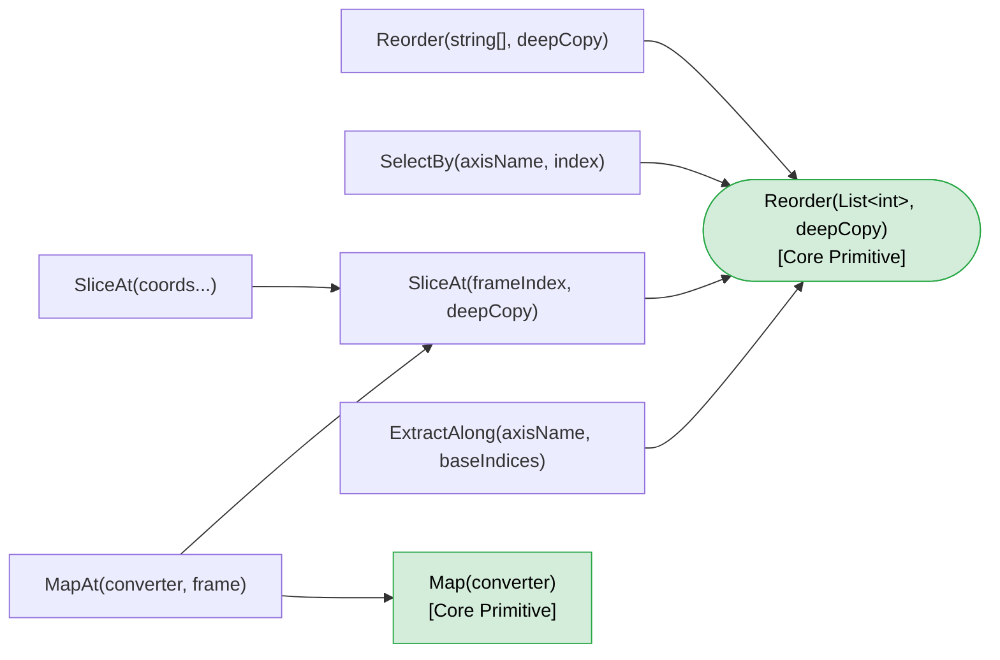
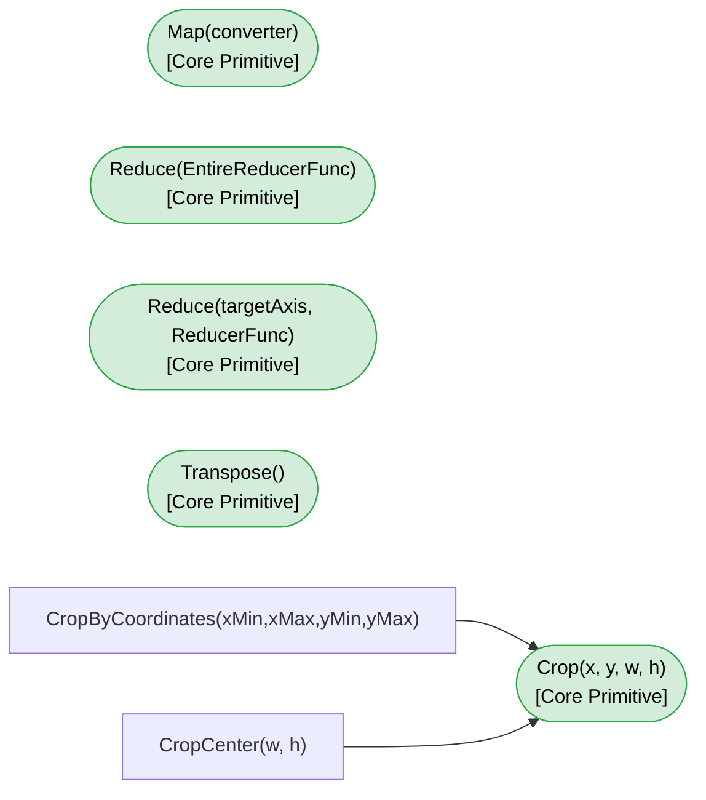
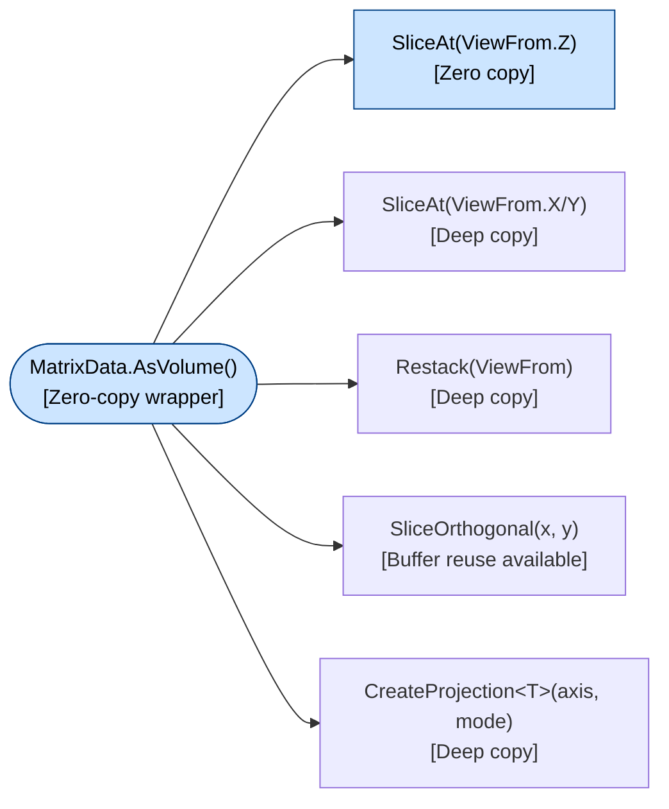

# MatrixData\<T\> メソッド体系リファレンス

**MxPlot.Core / MxPlot.Core.Processing — 呼び出しマップ & コピー戦略**

---

## 目次

1. [概要](#概要)
2. [呼び出しグラフ](#呼び出しグラフ)
3. [Layer 0 — データアクセス原語](#layer-0--データアクセス原語)
4. [Layer 1 — コア生成メソッド](#layer-1--コア生成メソッド)
5. [Layer 2 — 複合メソッド](#layer-2--複合メソッド)
6. [ゼロコピー使用上の注意](#ゼロコピー使用上の注意)
7. [クイックリファレンス：メソッドの選び方](#クイックリファレンスメソッドの選び方)

---

## 概要

`MatrixData<T>`

| 層 | 説明 |
|---|---|
| **Layer 0** | 新しい `MatrixData<T>` を生成しないデータアクセス原語（`GetArray`, `AsSpan` 等） |
| **Layer 1** | 他のメソッドから呼ばれる基盤となるコア生成メソッド（`Reorder`, `Crop`, `Map` 等） |
| **Layer 2** | Layer 1 を呼び出して機能を追加した複合メソッド（`SelectBy`, `SliceAt`, `CropCenter` 等） |

多くの Layer 2 メソッドは **`Reorder(List<int>, bool deepCopy)`** または **`Crop()`** を共通の起点として構築されています。
ゼロコピー（参照共有）が可能かどうかは主に `deepCopy` パラメーターの有無と Layer 1 メソッドの実装に依存します。

---

## 呼び出しグラフ

> 図が大きいため3つに分割しています。

### 図1 — Reorder / Slice 系（DimensionalOperator）

`Reorder(List<int>)` を共通基盤とする呼び出し連鎖です。



### 図2 — Crop / Reduce / Transpose 系（DimensionalOperator）

独立したコア基盤を持つメソッド群です（`Reorder` とは無関係）。



### 図3 — VolumeAccessor 系

`AsVolume()` を起点とする3D操作群です。



---

## Layer 0 — データアクセス原語

新しい `MatrixData<T>` インスタンスを生成しない、データへの直接アクセス手段です。
すべてゼロコピーで内部バッファへの参照・ビューを提供します。

| メソッド / プロパティ | 場所 | 戻り値 | ゼロコピー | 備考 |
|---|---|---|---|---|
| `GetArray(frameIndex)` | `MatrixData<T>` | `T[]` | ? 参照共有 | 書き込み可能。`IsReadOnly=false` の場合は呼び出し時に統計キャッシュを自動無効化 |
| `AsSpan(frameIndex)` | `MatrixData<T>` | `ReadOnlySpan<T>` | ? 参照共有 | 読み取り専用。統計キャッシュは無効化しない |
| `AsMemory(frameIndex)` | `MatrixData<T>` | `ReadOnlyMemory<T>` | ? 参照共有 | 読み取り専用。async パイプラインに適する |
| `this[ix, iy]` | `MatrixData<T>` | `T` | ? 直接アクセス | ピクセル1点の get/set。set で統計無効化 |
| `SetArray(array, frameIndex)` | `MatrixData<T>` | `void` | △ In-place | 配列長が一致すれば `CopyTo` でコピー。参照が同一なら無操作 |
| `AsVolume(axisName)` | `MatrixData<T>` | `VolumeAccessor<T>` | ? ラッパー | `_arrayList` の参照を保持するだけで、データコピーは発生しない |

---

## Layer 1 — コア生成メソッド

他の高レベルメソッドの起点となる基盤的な `MatrixData<T>` 生成メソッドです。
`Reorder(List<int>, bool)` と `Crop()` が Layer 2 の大半のベースになります。

### DimensionalOperator

| メソッド | ゼロコピー | 起点となる Layer 2 メソッド | 説明 |
|---|---|---|---|
| **`Reorder(List<int> order, bool deepCopy)`** | ? / ? 選択可 | `SelectBy`, `SliceAt(int)`, `ExtractAlong`, `Reorder(string[])` | **最重要基盤**。`deepCopy=false` では `T[]` 参照を共有。次元情報は除去される |
| **`Crop(int x, int y, int w, int h)`** | ? Deep only | `CropByCoordinates`, `CropCenter` | 行単位 `Array.Copy` で矩形 ROI を切り出す。物理スケールも自動更新 |
| `Map<TSrc, TDst>(converter, strategy)` | ? Deep only | `MapAt` | 全要素の型変換・変換処理。`NoValueRangeCheck` / `ParallelAlongFrames` の2戦略 |
| `Reduce(EntireReducerFunc)` | ? Deep only | ― | 全フレーム → 1フレームに縮約。`Parallel.For` でスレッドローカルバッファを使用 |
| `Reduce(targetAxisName, ReducerFunc)` | ? Deep only | ― | 指定軸を削除して N→N-1 次元縮約。コンテキスト座標 `ReadOnlySpan<int>` を提供 |
| `Transpose()` | ? Deep only | ― | キャッシュブロッキング (BlockSize=32) 付き並列転置 |

### MatrixData / MatrixData.Static

| メソッド | ゼロコピー | 説明 |
|---|---|---|
| `Clone()` | ? Deep only | 統計・次元情報・メタデータごと完全複製 |
| `Duplicate<T>()` *(拡張メソッド)* | ? Deep only | `Clone()` を呼ぶシュガー構文 |

### VolumeAccessor

`AsVolume()` が返す `VolumeAccessor<T>` 上で動作するメソッド群です。

| メソッド | ゼロコピー | 説明 |
|---|---|---|
| `Restack(ViewFrom direction)` | ? Deep only | 3D→3D。視点を X/Y/Z 方向に切り替えて全データ再配置 |
| `SliceAt(ViewFrom.Z, index)` | ? **Zero copy** | `_frames[iz]` の `T[]` を直接ラップして `MatrixData<T>` を生成。**唯一の VA ゼロコピー** |
| `SliceAt(ViewFrom.X, index)` | ? Deep only | YZ 平面を列方向スキャンで新配列に書き出す |
| `SliceAt(ViewFrom.Y, index)` | ? Deep only | XZ 平面を行コピー (`Span.CopyTo`) で新配列に書き出す |
| `SliceOrthogonal(x, y, numThreads, dstXZ, dstYZ)` | △ バッファ再利用可 | XZ + YZ 平面を1パスで同時抽出。`dstXZ`/`dstYZ` に既存 `MatrixData<T>` を渡すと配列を再利用 |

### VolumeOperator (VolumeAccessorExtensions)

| メソッド | ゼロコピー | 制約 | 説明 |
|---|---|---|---|
| `CreateProjection<T>(axis, mode)` | ? Deep only | `INumber<T>, IMinMaxValue<T>` 必須 | MIP / MinIP / AIP 投影。X/Y/Z 軸の3方向に対応 |

---

## Layer 2 — 複合メソッド

Layer 1 メソッドを組み合わせた高レベル API です。
ゼロコピーの可否は内部で呼ぶ Layer 1 メソッドに依存します。

### DimensionalOperator（`Reorder` ベース）

| メソッド | 内部で呼ぶ Layer 1 | ゼロコピー | 説明 |
|---|---|---|---|
| `SelectBy(axisName, index, deepCopy)` | `Reorder(List<int>, bool)` | ? / ? 選択可 | 指定軸の1スライスを選択し、その軸を次元から除去して返す |
| `SliceAt(int frameIndex, bool deepCopy)` | `Reorder(List<int>, bool)` | ? / ? 選択可 | 単フレームを「要素数1の `Reorder`」として実装 |
| `SliceAt((string, int)[] coords)` | `SliceAt(int, false)` | ? **Zero copy only** | 軸名+インデックスの組み合わせで座標指定。`deepCopy` オプションなし、常に shallow |
| `ExtractAlong(axisName, baseIndices, deepCopy)` | `Reorder(List<int>, bool)` | ? / ? 選択可 | 他軸を固定して指定軸に沿った 1D スライスを抽出 |
| `Reorder(string[] newAxisOrder, bool deepCopy)` | `Reorder(List<int>, bool)` | ? / ? 選択可 | 軸の順序組み替え（例: `ZCT → CZT`）。全フレームの並び替えのみでデータは不変 |

### DimensionalOperator（`Crop` ベース）

| メソッド | 内部で呼ぶ Layer 1 | ゼロコピー | 説明 |
|---|---|---|---|
| `CropByCoordinates(xMin, xMax, yMin, yMax)` | `Crop(x, y, w, h)` | ? Deep only | 物理座標 → ピクセルインデックスに変換してから `Crop` に委譲 |
| `CropCenter(w, h)` | `Crop(x, y, w, h)` | ? Deep only | 中心座標を自動計算してから `Crop` に委譲 |

### DimensionalOperator（`Map` + `SliceAt` ベース）

| メソッド | 内部で呼ぶ Layer 1 | ゼロコピー | 説明 |
|---|---|---|---|
| `MapAt<TSrc,TDst>(converter, frame)` | `SliceAt(int, false)` → `Map` | ? Deep only | Shallow な `SliceAt` の後に `Map` を適用するため、最終的に Deep copy となる |

---

## ゼロコピー使用上の注意

### 参照共有の仕組み

`deepCopy=false`（デフォルト）での `Reorder` および派生メソッドでは、
新しい `MatrixData<T>` インスタンスの `_arrayList` に元の `T[]` の参照が格納されます。

```
MatrixData<T> src                   MatrixData<T> result (shallow)
  _arrayList[0] ──────────────────────? 同じ T[] インスタンス
  _arrayList[1] ──────────────────────? 同じ T[] インスタンス
  _arrayList[2] ──────────────────────? 同じ T[] インスタンス
```

### 注意事項

| 状況 | 影響 |
|---|---|
| 元の `MatrixData` を `SetValueAt` 等で変更する | shallow な派生先にも即座に反映される |
| `GetArray()` で取得した配列を直接書き換える | 統計キャッシュが陳腐化する（`Invalidate` を呼ぶか、次回 `GetValueRange` 時に再計算される） |
| `VirtualFrameList` バックエンド使用時 | `IsReadOnly=true` のため `GetArray()` は統計キャッシュを無効化しない |
| ゼロコピーの `MatrixData` を `Dispose` する | 元データには影響しない（`VirtualFrameList` 所有権は `IsOwned` フラグで管理） |

---

## クイックリファレンス：メソッドの選び方

| 目的 | 推奨メソッド | コピー |
|---|---|---|
| 特定フレームを読み取りのみで参照 | `AsSpan(frameIndex)` / `AsMemory(frameIndex)` | Zero |
| 軸を指定してフレーム群を切り出す（読み取り中心） | `SelectBy` / `SliceAt` / `ExtractAlong`（`deepCopy=false`） | Zero |
| 独立した編集用コピーを作る | `Clone()` / `Duplicate()` / `deepCopy=true` | Deep |
| 軸の順序を変えて再配置する | `Reorder(string[])` | Zero / Deep |
| 型変換・ピクセル演算 | `Map<TSrc,TDst>` / `MapAt` | Deep |
| 全フレームを1枚に統合（Mean, Max など） | `Reduce(EntireReducerFunc)` | Deep |
| 指定軸を削除して次元削減 | `Reduce(targetAxisName, ReducerFunc)` | Deep |
| 矩形 ROI の切り出し | `Crop` / `CropByCoordinates` / `CropCenter` | Deep |
| 3D 直交断面の高速更新 | `VolumeAccessor.SliceOrthogonal`（バッファ再利用） | △ |
| 視点変換（XY → YZ 積層など） | `VolumeAccessor.Restack(ViewFrom)` | Deep |
| MIP / MinIP / AIP 投影 | `VolumeAccessor.CreateProjection<T>` | Deep |
| Z 軸方向の単フレーム参照 | `VolumeAccessor.SliceAt(ViewFrom.Z, iz)` | Zero |

---

## See Also

- [MatrixData Operations Guide](./MatrixData_Operations_Guide.md)
- [MatrixData Frame Sharing Model](./MatrixData_Frame_Sharing_Model.md)
- [DimensionStructure & Memory Layout Guide](./DimensionStructure_MemoryLayout_Guide.md)
- [VolumeAccessor Guide](./VolumeAccessor_Guide.md)
